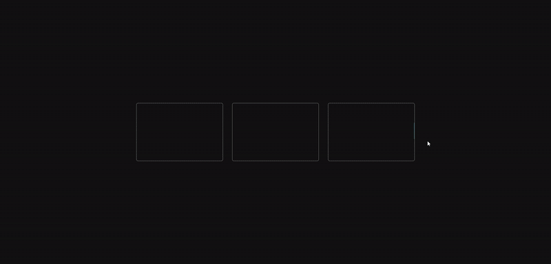

# MOLT BOX

**시각적 인터랙션과 애니메이션 기반의 UI 컴포넌트를 실험하고 수집하는 개인 프로젝트입니다.**  
컴포넌트의 기능성보다 시각적 표현과 인터페이스의 다양성에 초점을 맞추고 있습니다.

## 🎯 목적

- 다양한 애니메이션, 레이아웃, 인터랙션 실험
- 실사용보다는 **시각적 아이디어 저장소** 역할
- 프론트엔드 개발자 개인 실험

## 🔧 기술 스택

- React + TypeScript
- SCSS / Tailwind CSS
- Framer Motion
- Vite

## Cascading Card

스크롤 애니메이션이 적용된 수직 카드 스택 UI 컴포넌트입니다.  
카드는 시간차를 두고 부드럽게 흘러내리며, 각 `container`는 독립적으로 애니메이션됩니다.

- **개별 카드 컨테이너마다 animation delay / duration 다르게 적용**
- **hover 시 해당 카드 컨테이너의 애니메이션만 멈춤**
- **상/하단 영역에 `blur mask` 처리로 시각적 깊이감 제공**

**인터랙티브한 콘텐츠 리스트, 팀 소개, 블로그 카드 등 다양한 연출에 활용 가능합니다.**

## Cloud Animation

Three.js 기반으로 구현된 몰입형 클라우드 애니메이션 컴포넌트입니다.  
구름 텍스처와 라이트 이펙트를 활용해 생동감 있는 하늘을 연출하며, 시야에 들어올 때만 렌더링되어 성능도 고려한 구성입니다.

- **시야(Intersection Observer)에 따라 렌더링 최적화**
- **구름 텍스처 및 색상 조합으로 다양한 분위기 연출 가능**
- **Fog 및 조명 효과를 통한 입체감 있는 배경 구성**
- **비 입자 효과(rain particle) 포함 및 커스터마이징 가능**

**랜딩 페이지 배경, 인트로 씬, 혹은 스크롤 콘텐츠 사이 전환 효과 등 감각적인 시각 연출에 활용할 수 있습니다.**

## Interaction Slide

페이지네이션과 반응형 그리드 시스템을 적용한 인터랙티브 슬라이드형 UI 컴포넌트입니다.  
슬라이드는 `페이지 단위`로 가로로 이동하며, 사용자 디바이스 너비에 따라 자동으로 아이템 수가 조절됩니다.

- **페이지 단위 슬라이딩 기능**
- **디바이스 크기에 따라 자동 반응형 레이아웃 (데스크탑/태블릿/모바일 대응)**
- **아이템 개별 opacity 처리로 현재 페이지 강조**
- **유저 정보 및 텍스트 콘텐츠를 시각적으로 정돈된 카드 레이아웃으로 표현**

**소개 슬라이드, 피플 리스트, 블로그 카드, 콘텐츠 모음 등 다양한 상황에 적용할 수 있습니다.**

## Gradient Hover

마우스 근접·호버 반응형 테두리 글로우 UI 컴포넌트입니다.
커서가 근처에 오면 양끝이 자연스럽게 페이드(블러) 되는 스팟 라인이 나타나고, 호버 시에는 전체 테두리가 부드럽게 펼쳐지는 트랜지션으로 강조됩니다.

- **근접 스팟 라인: 커서 주변에만 선이 나타나고 양끝을 블러로 자연스럽게 처리**

- **호버 전개 애니메이션: `clip-path` 반경을 키우는 방식으로 전체 라인이 스무스하게 표시**

- **강한 라인 강조: 근접/호버 모두 동일 팔레트로 색상 유지, 대비·채도 부스트로 “쎄게” 표현**

- **빛 번짐(halo): `::before`에 화이트/할로 컬러를 더해 어둠 속에서 빛나는 느낌**

- **접근성/성능: `prefers-reduced-motion` 대응, `requestAnimationFrame` + `contain: paint`로 최적화**

인포 카드, 버튼/패널 하이라이트, 인터랙티브 히어로 섹션, 네온 테마 UI 등 다양한 상황에 적용할 수 있습니다.

